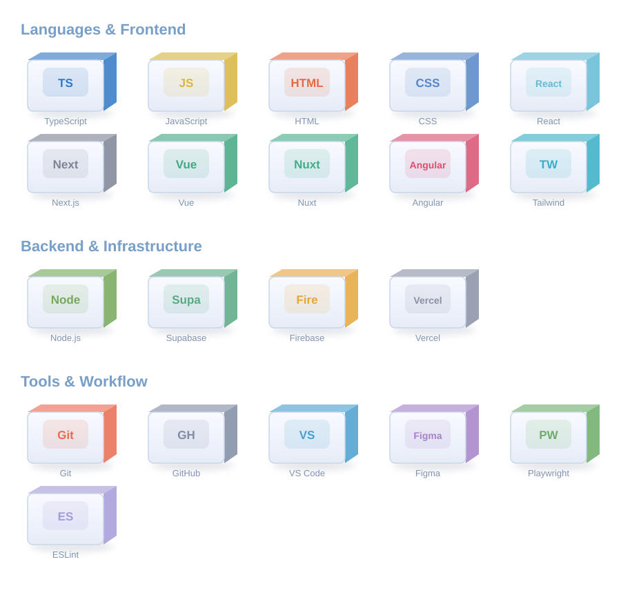

# Hi, I'm Chitipat 👋

**Curious by nature. Building with purpose.**

A developer from Thailand who enjoys turning ideas into useful digital experiences.

---

### A little about me

I like understanding **how things work** — and finding ways to make them better. I care about the small details, especially when they make technology easier and more enjoyable for people to use.

- 🌱 Learning through building, experimenting, and asking questions
- 🎨 Interested in frontend development, UI/UX, and creative web experiences
- 🔐 Exploring cybersecurity and how to build more trustworthy software
- ✨ Trying to make things that are not just functional, but meaningful

## Things I build with

  

### Selected projects

**[YAAN](https://yaan-nu.vercel.app/)**  
Exploring neighborhoods through maps, nearby places, and location context — with a focus on making information easier to understand.

**[Computer Programmer Department Website](https://computer-programmer-department.vercel.app/)**  
A website introducing my department, its learning paths, projects, and opportunities to future students.

**Responsive Checker**  
A command-line tool for checking responsive layouts across different viewport sizes. *(Repository link to be added.)*

---

*Still learning. Still building. Still curious.*

Made with curiosity and a little bit of periwinkle ✳

